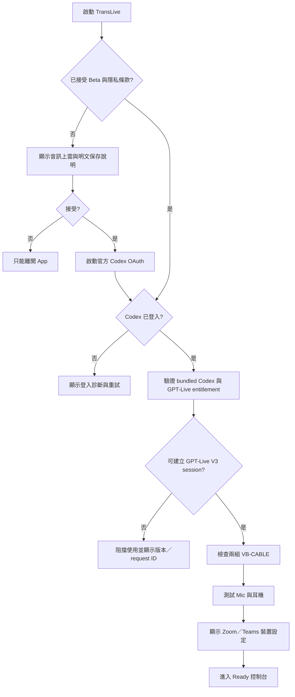
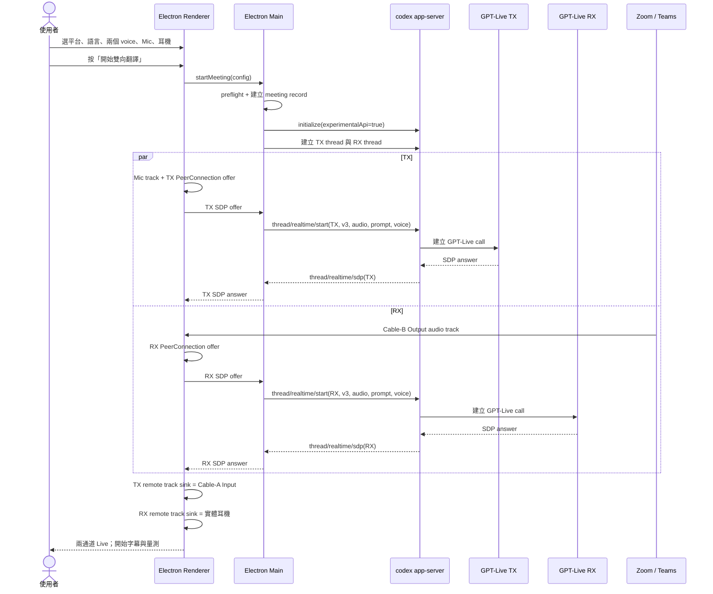
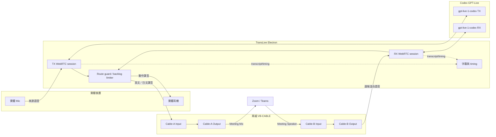
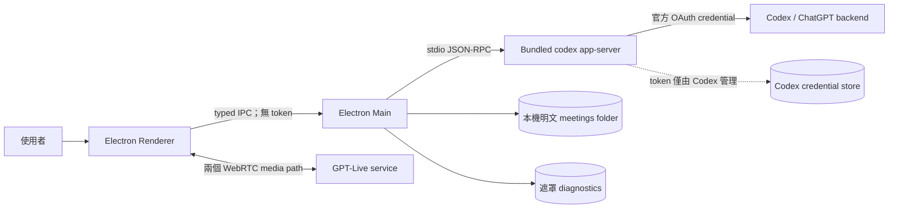
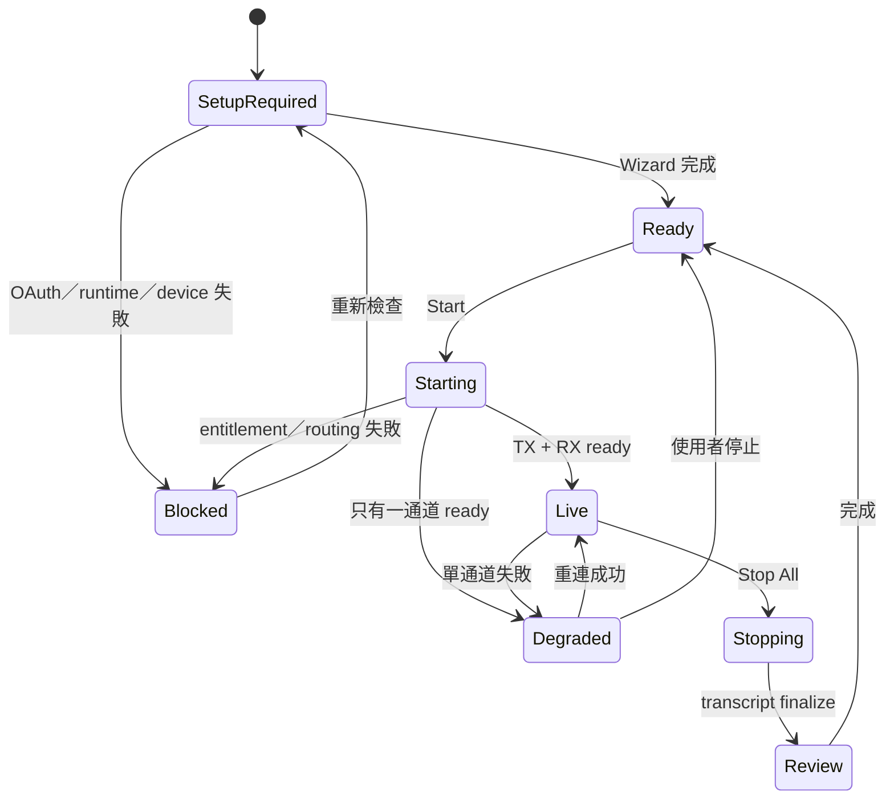

# TransLive 封閉 Beta 產品設計

> **狀態：**已確認設計基線
>
> **日期：**2026-08-28
>
> **目標：**Windows 上以 Codex GPT‑Live V3 實驗路徑，為 Zoom／Teams 提供繁中↔英文與繁中↔日文的低延遲雙向語音翻譯。

## 先決限制

1. `gpt-live-1-codex`、`/v1/live` 與 Codex realtime RPC 目前仍屬 experimental；**封閉 Beta 可驗證，但不可直接視為正式商業 API 合約**。
2. 每位測試者必須透過官方 Codex／ChatGPT OAuth 登入；TransLive 不讀取、保存或轉交 OAuth token。
3. Beta 使用兩組 VB‑CABLE，並要求使用耳機。Zoom／Teams 的裝置由使用者手動選擇。
4. 逐字稿會永久以明文 Markdown／JSON 儲存在本機。這是已確認的 Beta 決策，但存在明確隱私風險；不保存任何音訊。
5. GPT‑Live entitlement 不可用時阻擋啟動，不靜默切換其他模型。

研究依據：

- [Windows 即時翻譯架構研究](../research/windows-realtime-translation-architecture.md)
- [Codex GPT‑Live 原始碼研究](../research/codex-gpt-live-implementation.md)

## 1. 產品範圍

### 1.1 Beta 使用情境

使用者在 Zoom 或 Teams 會議中：

- 說繁中，對方聽到英文或日文譯音；
- 對方說英文或日文，使用者耳機聽到繁中譯音；
- 兩方向同時保持連線，並可分別 mute；
- 查看來源與譯文字幕、即時延遲及通道健康狀態；
- 會後查看永久保存的逐字稿，並按需產生會議摘要。

### 1.2 支援矩陣

| 我的語言 | 對方語言 | TX：我→會議 | RX：會議→我 |
| --- | --- | --- | --- |
| 繁中（台灣） | 英文 | 繁中→英文 | 英文→繁中 |
| 英文 | 繁中（台灣） | 英文→繁中 | 繁中→英文 |
| 繁中（台灣） | 日文 | 繁中→日文 | 日文→繁中 |
| 日文 | 繁中（台灣） | 日文→繁中 | 繁中→日文 |

不支援英文↔日文，也不做三語自動偵測。同語言組合禁止啟動。

### 1.3 Beta 不做

- Zoom／Teams SDK、Bot、會議控制或參與者分軌；
- 自製虛擬音訊驅動；
- GPT‑Live 不可用時自動 fallback；
- voice clone、Seed‑VC、RVC；
- 喇叭模式與自製 AEC；
- 雲端逐字稿同步、錄音、全文搜尋或標籤；
- 自動操作 Zoom／Teams UI；
- 會議中切換語言或音色。

## 2. 功能設計

### 2.1 P0：開始一場雙向翻譯

| 功能 | 行為 | 失敗時 |
| --- | --- | --- |
| ChatGPT OAuth | UI 呼叫官方 Codex 登入流程；只顯示登入狀態 | 阻擋 Start，提供重新登入 |
| Codex runtime | 使用 Beta 內附、固定版本的 Codex binary | 版本或 checksum 不符即阻擋 |
| GPT‑Live entitlement | 啟動前建立測試 session 驗證 | 顯示模型、Codex 版本、request ID，不 fallback |
| 平台選擇 | 手動選 Zoom 或 Teams | 未選平台不得 Start |
| 裝置檢查 | 選實體 Mic／耳機；自動配對兩組 cable | 缺失或形成環路即阻擋 |
| 雙 session | TX、RX 使用不同 thread 與 PeerConnection | 單通道失敗時進入 degraded 模式 |
| 僅譯音 | TX 只送譯音；RX 耳機只播譯音 | 絕不自動改播原音 |
| 字幕 | 同時顯示來源與譯文 | transcript event 缺失不停止音訊 |
| 延遲保護 | backlog 超過 1.5 秒時丟棄過期譯音 | 字幕標記音訊缺口 |

### 2.2 P0：會議中控制

- TX mute：主畫面按鈕與全域快捷鍵；只停止送出我的聲音。
- RX mute：主畫面與迷你浮窗控制；不影響 TX。
- Stop All：主畫面、迷你浮窗與全域快捷鍵。
- 通道狀態：`Connecting`、`Live`、`Muted`、`Reconnecting`、`Failed`。
- 單通道自動重連：另一通道繼續；故障方向保持靜音。
- 語言、音色、平台與裝置在 Live 狀態鎖定。

### 2.3 P0：逐字稿

- 自動建立每場會議的 Markdown 與 JSON；
- 保存 TX/RX 來源文字、譯文、相對時間戳及音訊缺口；
- 永久明文保存，沒有自動清除期限；
- 不保存原始或翻譯音訊；
- UI 提供查看、開啟資料夾、單場刪除與全部刪除；
- 首次使用需同意；Live 畫面持續顯示「雲端傳輸中／逐字稿保存中」。

### 2.4 P1：會議摘要

停止翻譯後，由使用者按「產生摘要」：

- 使用同一 Codex 登入，但建立獨立文字任務；
- 再次把完整逐字稿送到模型前顯示明確提示；
- 固定產出：重點、決策、待辦、未決問題；
- 每項引用逐字稿時間戳；
- 未提及的負責人或日期標示「未指定」，不得臆測；
- 保存為 `summary.md`，不覆寫原始逐字稿。

### 2.5 P1：Beta 診斷

- 主畫面：TX/RX 當前 TTFA／lag 與綠黃紅狀態；
- 診斷抽屜：RTT、p50/p95、dropout、播放 queue、重連次數、request ID；
- 匯出遮罩診斷包，預設不包含逐字稿；
- 裝置名稱可保存，但 endpoint ID 只輸出 hash；
- 不輸出 OAuth token、Authorization header、ChatGPT account ID 或 raw SDP。

## 3. 資訊架構

```text
TransLive
├─ 首次設定 Wizard
│  ├─ 隱私與 Beta 限制
│  ├─ ChatGPT OAuth
│  ├─ Codex runtime／entitlement
│  ├─ VB-CABLE 檢查
│  └─ Mic／耳機／Zoom／Teams 設定測試
├─ 會議控制台
│  ├─ 會議設定
│  ├─ TX 通道
│  ├─ RX 通道
│  ├─ 雙語字幕
│  └─ 診斷抽屜
├─ 置頂迷你浮窗
├─ 會議歷史
│  ├─ 逐字稿
│  ├─ 摘要
│  └─ 刪除／開啟資料夾
└─ 設定
   ├─ 一般
   ├─ 音訊
   ├─ 快捷鍵
   ├─ 儲存與隱私
   └─ 開發者模式
```

## 4. 畫面 Layout

### 4.1 首次設定 Wizard

```text
┌──────────────────────────────────────────────────────────────┐
│ TransLive Setup                                      2 / 5  │
├──────────────────────────────────────────────────────────────┤
│ ChatGPT / Codex 登入                                          │
│                                                              │
│  ● Codex runtime  0.150.x（Beta pinned）                      │
│  ○ ChatGPT 尚未登入                                           │
│                                                              │
│  [ 使用瀏覽器登入 ChatGPT ]                                   │
│                                                              │
│  TransLive 不會讀取或保存你的 OAuth token。                    │
│                                                              │
├──────────────────────────────────────────────────────────────┤
│ [上一步]                                           [繼續]     │
└──────────────────────────────────────────────────────────────┘
```

Wizard 步驟：

1. **風險同意**：experimental GPT‑Live、音訊送雲端、永久明文逐字稿、不錄音。
2. **登入**：啟動官方 Codex OAuth；回到 App 後只確認 authenticated 狀態。
3. **虛擬裝置**：檢查 Cable A/B 的 playback／recording endpoint；顯示手動安裝連結與重新掃描。
4. **實體裝置**：Mic meter、耳機 test tone；若選到喇叭則阻擋並解釋 feedback 風險。
5. **會議軟體**：分別顯示 Zoom／Teams 應選的 Mic 與 Speaker，使用 meter 驗證路由。

### 4.2 單頁會議控制台：未開始

```text
┌────────────────────────────────────────────────────────────────────────┐
│ TransLive        Ready ●         ChatGPT: 已登入     [歷史] [設定]     │
├────────────────────────────────────────────────────────────────────────┤
│ 平台 [ Microsoft Teams ▼ ]                                             │
│                                                                        │
│ 我的語言 [繁中（台灣）▼]  ⇄  對方語言 [英文▼]                          │
│                                                                        │
│ 實體 Mic [Headset Microphone ▼]  對方聽到的音色 [Marin ▼]              │
│ 我的耳機 [USB Headphones ▼]      我聽到的音色   [Cove ▼]               │
│                                                                        │
│ Virtual OUT  Cable A ✓       Virtual IN  Cable B ✓       耳機 ✓       │
│                                                                        │
│                [ 測試路由 ]       [ 開始雙向翻譯 ]                     │
├────────────────────────────────────────────────────────────────────────┤
│ Teams 設定：Mic = CABLE-A Output；Speaker = CABLE-B Input              │
└────────────────────────────────────────────────────────────────────────┘
```

### 4.3 單頁會議控制台：Live

```text
┌────────────────────────────────────────────────────────────────────────┐
│ TransLive  LIVE ●  00:18:42   Teams    雲端傳輸中｜明文保存中          │
│                                             [迷你模式] [全部停止]       │
├───────────────────────────────────┬────────────────────────────────────┤
│ TX｜我 → 對方                    │ RX｜對方 → 我                       │
│ Live ●   1.2s   ▂▅▇▃             │ Reconnecting ◐  2/3                 │
│ 繁中 → 英文   Voice: Marin       │ 英文 → 繁中   Voice: Cove           │
│ [TX 靜音]                         │ [RX 靜音] [立即重試]                 │
├───────────────────────────────────┴────────────────────────────────────┤
│ 我說                                                               │
│ 「我們預計第三季開始正式量產。」                                     │
│ 對方聽到                                                           │
│ “We expect to begin mass production in the third quarter.”          │
│                                                                        │
│ 對方說                                                             │
│ “Could you confirm the validation schedule?”                        │
│ 我聽到                                                             │
│ 「可以確認一下驗證時程嗎？」                                         │
├────────────────────────────────────────────────────────────────────────┤
│ TX TTFA 1.2s ●   RX TTFA 2.1s ▲   queue 0.3s   [診斷 ∧]              │
│ Transcript: AppData\TransLive\meetings\2026-08-28_...                │
└────────────────────────────────────────────────────────────────────────┘
```

Live 狀態不顯示可編輯 dropdown，避免誤以為可無縫切換。若只有一條通道可用，頂部改為黃色 `DEGRADED`。

### 4.4 置頂迷你浮窗

```text
┌──────────────────────────────────────┐
│ TransLive LIVE ●  TX 1.2s  RX 1.7s  │
│ 對方聽到：We expect to begin…        │
│ 我聽到：可以確認一下…                │
│ [TX Mute] [RX Mute] [Stop] [展開]    │
└──────────────────────────────────────┘
```

- 可拖曳、記住位置、切換置頂；
- 不提供語言、音色或裝置設定；
- `Stop` 需二次確認或長按 600 ms，避免誤觸；
- DEGRADED／Reconnecting 必須以文字呈現，不能只靠顏色。

### 4.5 會議歷史

```text
┌──────────────────────────────────────────────────────────────────────┐
│ 會議歷史                                             [開啟資料夾]   │
├──────────────────────┬───────────────────────────────────────────────┤
│ 08/28 14:00 Teams    │ 2026-08-28 14:00 · Teams · 繁中↔英文         │
│ 24m · 已有摘要       │ [逐字稿] [摘要]                               │
│                      │                                               │
│ 08/27 09:30 Zoom     │ 重點                                          │
│ 42m · 尚未摘要       │ • 第三季量產計畫 [00:12:34]                   │
│                      │                                               │
│                      │ [產生／重新產生摘要] [刪除] [開啟資料夾]      │
└──────────────────────┴───────────────────────────────────────────────┘
```

## 5. 可設定參數

### 5.1 一般使用者設定

| 參數 | 可選值 | 預設 | Live 中 |
| --- | --- | --- | --- |
| 平台 | Zoom／Teams | Teams | 鎖定 |
| 我的語言 | 繁中／英文／日文 | 繁中 | 鎖定 |
| 對方語言 | 英文／日文／繁中，依支援矩陣限制 | 英文 | 鎖定 |
| TX voice | bundled Codex runtime 驗證通過的 voice enum | Marin | 鎖定 |
| RX voice | bundled Codex runtime 驗證通過的 voice enum | Cove | 鎖定 |
| 實體 Mic | Windows capture endpoints | Windows 通訊預設 | 鎖定 |
| 實體耳機 | Windows render endpoints；排除 virtual cable | Windows 通訊預設 | 鎖定 |
| TX/RX 音量 | 0–100 | 100 | 可調 |
| 迷你浮窗 | 開／關 | 關 | 可調 |
| 逐字稿路徑 | 使用者資料夾 | `%LOCALAPPDATA%\TransLive\meetings` | 不可改 |

Codex pinned source 暴露的 voice 集合包含 Alloy、Arbor、Ash、Ballad、Breeze、Cedar、Coral、Cove、Echo、Ember、Juniper、Maple、Marin、Sage、Shimmer、Sol、Spruce、Vale、Verse。App 啟動時以 bundled runtime schema 驗證，不能只相信硬編碼清單。

### 5.2 固定安全參數

| 參數 | Beta 值 | 理由 |
| --- | --- | --- |
| Realtime version | `v3` | Frameless Bidi |
| Model | `gpt-live-1-codex` | 使用者指定的 GPT‑Live P0 |
| Output modality | `audio` | V3 不支援 text-only output |
| Sessions | 2 個不同 thread | 同一 thread 第二次 start 會停止前一個 |
| Output mode | 僅譯音 | 避免雙語重疊 |
| `includeStartupContext` | `false` | 不載入 Codex coding context |
| `clientManagedHandoffs` | `true` | 不讓 Codex自動代理 handoff |
| `delegationAckFiller` | `false` | 避免「嗯、好的」等非翻譯輸出 |
| Max audio backlog | 1,500 ms | 低延遲優先；超過便丟棄過期譯音 |
| Reconnect | 1s、2s、4s，共 3 次 | 有界重試；另一通道保持運行 |
| Transcript | 永久、明文 MD＋JSON | 已確認 Beta 決策 |
| Audio recording | 關閉 | 降低隱私與磁碟風險 |

### 5.3 開發者模式

開發者模式預設關閉，需輸入確認文字後開啟。允許：

- 查看 bundled Codex 版本、模型、thread ID、state transition；
- 覆寫測試 prompt、voice、backlog 上限與 reconnect 時序；
- 匯入／匯出不含憑證的實驗設定；
- 顯示 WebRTC stats、audio level、RTT、jitter、packets lost；
- 一鍵恢復 Beta 安全預設。

即使在開發者模式，也不可顯示或匯出 OAuth token、Authorization header、account ID、raw SDP。

### 5.4 快捷鍵

| 動作 | 預設 |
| --- | --- |
| TX mute／unmute | `Ctrl+Alt+M` |
| Stop All | `Ctrl+Alt+Shift+S` |
| 顯示／隱藏迷你窗 | `Ctrl+Alt+T` |

快捷鍵可修改；衝突時不得註冊，並在設定頁顯示原因。

## 6. 操作 Flow

### 6.1 首次使用



### 6.2 開始翻譯



### 6.3 停止與摘要

1. UI 立即 mute TX/RX render，避免關閉過程送出殘留音訊；
2. 分別送 `thread/realtime/stop`；
3. 最多等待 1 秒處理已收到的 transcript event，不等待無限 audio drain；
4. 關閉 PeerConnection、MediaStreamTrack 與 cable render；
5. 寫完 `transcript.md`、`transcript.json`、`metadata.json`；
6. 顯示會後畫面與「產生摘要」；
7. 使用者按下後，建立獨立 Codex 文字任務並保存 `summary.md`。

## 7. 音訊與控制資料流

### 7.1 雙向音訊資料流



不可違反的路由規則：

- TX 只接受實體 Mic，不接受 Cable B、耳機輸出或 RX 譯音；
- RX 只接受 Cable-B Output，不接受實體 Mic 或 Cable-A Output；
- TX remote audio 只能輸出到 Cable-A Input；
- RX remote audio 只能輸出到實體耳機；
- endpoint ID 重複、接反或形成 cycle 時阻擋 Start。

### 7.2 控制面與安全邊界



Renderer 不得取得 Codex credential store 路徑內容。Main process 只判斷登入狀態、啟動 app-server 與轉送 JSON-RPC。

## 8. 狀態與錯誤設計

### 8.1 App 狀態



### 8.2 單通道恢復

| 錯誤 | 自動行為 | UI |
| --- | --- | --- |
| WebRTC disconnected | 1s／2s／4s 重連；故障方向靜音 | 黃色 Reconnecting、次數 1/3 |
| 三次失敗 | 保留另一通道，停止自動重試 | 紅色 Failed、立即重試 |
| app-server crash | 兩通道靜音；只自動重啟一次 | 頂部 DEGRADED／BLOCKED |
| Mic／耳機拔除 | 停止受影響通道，不自動改用預設裝置 | 要求重新選擇 |
| Cable 消失 | 立即停止對應 render/capture | 阻擋重連直到 cable 恢復 |
| backlog >1.5s | 丟棄最舊譯音至最新安全邊界 | `Audio gap` 標記與黃色提示 |
| entitlement／403 | 不重試、不 fallback | BLOCKED＋request ID |

## 9. 本機資料設計

```text
%LOCALAPPDATA%\TransLive\
├─ settings.json
├─ diagnostics\
│  └─ translive-YYYYMMDD.log
└─ meetings\
   └─ 2026-08-28_140000_teams_zh-en\
      ├─ metadata.json
      ├─ transcript.json
      ├─ transcript.md
      └─ summary.md          # 使用者要求後才存在
```

`transcript.json` 最小事件格式：

```json
{
  "atMs": 12430,
  "flow": "tx",
  "sourceLanguage": "zh-TW",
  "targetLanguage": "en",
  "sourceText": "我們預計第三季開始正式量產。",
  "translatedText": "We expect to begin mass production in the third quarter.",
  "firstAudioLatencyMs": 1320,
  "audioDropped": false
}
```

`metadata.json` 保存：

- meeting ID、開始／結束時間、平台、語言 pair；
- TX/RX voice、App/Codex 版本；
- 實體裝置顯示名稱與 endpoint ID hash；
- TTFA／lag p50、p95、dropout、重連與 audio gap 次數；
- 不保存 OAuth token、account ID、raw SDP、原始或翻譯音訊。

刪除會議時刪除整個 meeting folder。全部刪除需輸入 `DELETE` 確認；永久明文保存仍不代表不可由使用者刪除。

## 10. 延遲與驗收參數

使用者選擇寬鬆 Beta gate；這是驗收上限，不是優化目標或供應商 SLA。

| 指標 | Go | 黃色 | 紅色／需調查 |
| --- | ---: | ---: | ---: |
| TTFA P50 | ≤1.5s | 1.5–2.0s | >2.0s |
| TTFA P95 | ≤2.5s | 2.5–3.0s | >3.0s |
| 持續 interpretation lag P95 | ≤4.0s | 4.0–5.0s | >5.0s |
| Audio backlog | ≤0.8s | 0.8–1.5s | >1.5s；丟棄過期音訊 |
| 單通道 10 分鐘測試 | 無 feedback／無限 queue | — | 任一發生即失敗 |

翻譯品質以外部使用者訪談的主觀滿意度判定；App 內不收集評分。診斷數據只回答延遲、穩定性與路由問題，不冒充翻譯品質指標。

## 11. Evidence → Finding → Path

| Evidence | Finding | Product path |
| --- | --- | --- |
| Codex source 有 `gpt-live-1-codex`、V3、`/v1/live` | 技術 PoC 可行，但 API／entitlement 未正式公開 | 封閉 Beta、固定 Codex、OAuth、無 entitlement 即阻擋 |
| 同 thread 只能有一個 realtime manager state | 不能用同一 thread 承載 TX/RX | 兩個 thread＋兩個 PeerConnection |
| Codex app-server RPC 標為 experimental | 升級可能破壞 protocol | 內附 pinned runtime，不跟隨系統 latest |
| Windows/Zoom/Teams 可選 OS audio endpoint | 首版不需要會議 SDK | 手動選 Cable A/B，App 提供 meter 與 checklist |
| 一條 cable 會混合兩方向並形成 feedback 風險 | TX/RX 必須物理隔離 | 兩組 VB-CABLE＋route guard＋耳機必須 |
| 低延遲是第一優先 | 不能允許 queue 無限累積 | backlog 1.5 秒硬上限，丟棄過期譯音並留下缺口紀錄 |
| 使用者要求永久明文逐字稿 | 儲存簡單但敏感 | 首次明確同意、持續指示、可刪除、不錄音 |

## 12. Beta 交付切片

1. **Runtime spike**：OAuth、bundled Codex、單一 GPT‑Live V3 WebRTC session。
2. **雙 session spike**：不同 thread 並行、prompt-only 中英／中日翻譯驗證。
3. **Audio routing**：兩組 VB-CABLE、耳機、TX/RX route guard。
4. **Meeting console**：Start/Stop、mute、字幕、狀態與延遲。
5. **Recovery**：單通道重連、backlog drop、裝置拔除。
6. **Persistence**：MD/JSON 逐字稿、歷史頁、刪除。
7. **Summary**：會後手動 Codex 文字摘要。
8. **Beta hardening**：Wizard、迷你浮窗、遮罩診斷包、pinned updater。

只有第 1–3 步證明 GPT‑Live entitlement、雙 thread 並行、翻譯品質與音訊路由可用後，才繼續完整 UI；不要先做自有 driver、voice clone 或雲端歷史服務。
